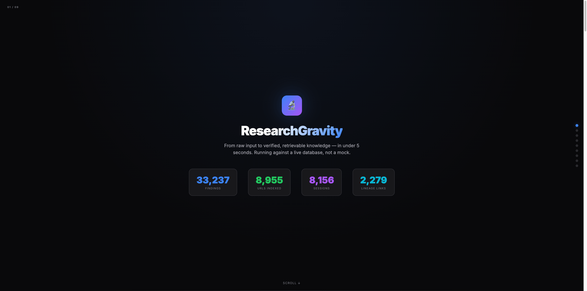
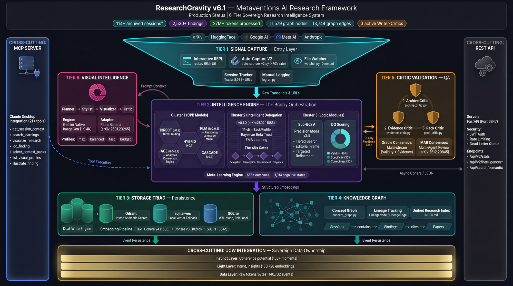
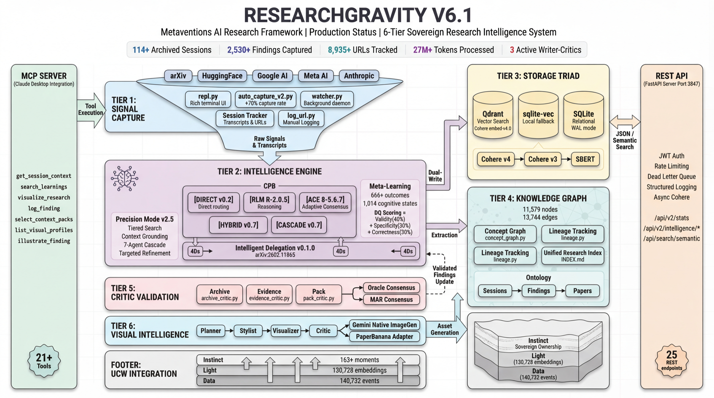

<p align="center">
  
</p>

<p align="center">
  <strong>Frontier intelligence for meta-invention. Research that compounds.</strong>
</p>

<p align="center">
  <em>"Let the invention be hidden in your vision"</em>
</p>

<p align="center">
  
  
  
  
</p>

<p align="center">
  
  
  
  
</p>

<p align="center">
  
  
  
</p>

<p align="center">
  
</p>

---

## Why • What's New • Architecture • Quick Start • Auto-Capture • Sources • Contact

---

## Proof Deck — See It Work

<p align="center">
  
</p>

<p align="center">
  <em>9-slide interactive proof: real DB stats, EvidencedFinding schema, 3-stream oracle critique, and a live pipeline demo that writes real findings to antigravity.db.</em>
</p>

<p align="center">
  <a href="scripts/proof/proof-deck.html"><strong>Open Interactive Deck</strong></a>
</p>

---

## What's New in v6.1 — Security & Reliability (January 2026)

**Production-hardened API with enterprise security.**

| Feature | Description |
|---------|-------------|
| **🔐 JWT Authentication** | Token-based auth with `/api/auth/token` endpoint |
| **⏱️ Rate Limiting** | slowapi integration (10/min search, 30/min write) |
| **🛡️ Input Validation** | Path traversal prevention, session ID sanitization |
| **📝 Structured Logging** | JSON/console formats with request context |
| **🔄 Dead-Letter Queue** | Failed writes queued for retry with exponential backoff |
| **⚡ Async Cohere** | Non-blocking embedding calls via `asyncio.to_thread` |
| **🔒 Connection Pool** | Semaphore-guarded SQLite pool (race condition fix) |

### Authentication

```bash
# Get JWT token
curl -X POST http://localhost:3847/api/auth/token \
  -H "Content-Type: application/json" \
  -d '{"client_id": "my-app", "scope": "write"}'

# Use token
curl -H "Authorization: Bearer <token>" http://localhost:3847/api/auth/me

# Or use API key
curl -H "X-API-Key: <your-api-key>" http://localhost:3847/api/v2/stats
```

### Environment Variables

```bash
export RG_SECRET_KEY=$(python -c "import secrets; print(secrets.token_hex(32))")
export RG_API_KEY="your-service-api-key"
export RG_LOG_LEVEL="INFO"  # DEBUG, INFO, WARNING, ERROR
export RG_LOG_JSON="true"   # JSON format for production
```

---

## What's New in v6.0 — Interactive Research Platform (January 2026)

**From manual workflow to intelligent auto-capture.** 3x faster research sessions with real-time URL capture.

| Feature | Description |
|---------|-------------|
| **🎮 Interactive REPL** | Real-time research CLI with Rich terminal UI |
| **🔄 Auto-Capture V2** | Automatic URL/finding extraction from Claude sessions (+70% capture rate) |
| **🧠 Intelligence Layer** | CLI + API + REPL access to meta-learning predictions |
| **💾 sqlite-vec Storage** | Local vector storage with FTS fallback (no external dependencies) |
| **👁️ File Watcher** | Implicit session creation from Claude activity |
| **📊 Dual-Write Engine** | Qdrant + sqlite-vec with automatic failover |

### Interactive REPL

```bash
python3 scripts/session/repl.py

# Commands:
rg> start "multi-agent orchestration"   # Initialize session
rg> url https://arxiv.org/...           # Log URL (auto-classify)
rg> finding "Key insight about..."      # Capture finding
rg> predict                             # Session quality prediction
rg> search "consensus algorithms"       # Semantic search past sessions
rg> archive                             # Finalize session
```

### Auto-Capture V2

```bash
python3 scripts/session/auto_capture_v2.py scan         # Scan last 24 hours
python3 scripts/session/auto_capture_v2.py scan --hours 48
python3 scripts/session/auto_capture_v2.py status       # Show capture stats
```

### Intelligence CLI

```bash
python3 scripts/prediction/intelligence.py predict "task"   # Session quality prediction
python3 scripts/prediction/intelligence.py optimal-time     # Best hour for deep work
python3 scripts/prediction/intelligence.py errors "context" # Likely errors + prevention
python3 scripts/prediction/intelligence.py patterns         # Session patterns
```

### Intelligence API

| Endpoint | Method | Description |
|----------|--------|-------------|
| `/api/v2/intelligence/status` | GET | System capabilities |
| `/api/v2/intelligence/predict` | POST | Unified prediction |
| `/api/v2/intelligence/patterns` | GET | Session patterns |
| `/api/v2/intelligence/errors` | POST | Likely errors |
| `/api/v2/intelligence/feedback` | POST | Outcome feedback |

### File Watcher

```bash
python3 scripts/session/watcher.py daemon   # Start as background daemon
python3 scripts/session/watcher.py status   # Check daemon status
python3 scripts/session/watcher.py stop     # Stop daemon
```

### Storage Modes

```
Priority: Qdrant → sqlite-vec → FTS fallback
- Qdrant: Full semantic search (requires server)
- sqlite-vec: Single-file vectors (offline capable)
- FTS: Full-text search fallback (always available)
```

### Embedding Providers (SOTA 2026)

```
Priority: Cohere v4 → Cohere v3 → SBERT offline

Cohere embed-v4.0 (default):
- Multimodal (text + images)
- 128k context window
- Matryoshka dimensions: 256, 512, 1024, 1536

Dimension Options:
- 1536d: Maximum quality
- 1024d: Balanced (default)
- 512d:  50% storage savings
- 256d:  83% storage savings

Fallback Chain:
- Cohere v4 → Cohere v3 → SBERT (all-MiniLM-L6-v2)
```

Auto-switches on API failure. No manual configuration needed.

---

## What's New in v5.0 — Chief of Staff (January 2026)

**The AI Second Brain is now complete.** Full infrastructure for sovereign knowledge management.

| Feature | Description |
|---------|-------------|
| **🔮 Meta-Learning Engine** | Predictive session intelligence from 666+ outcomes, 1,014 cognitive states |
| **🏛️ Storage Triad** | SQLite (WAL mode, FTS5) + Qdrant (semantic search) |
| **⚖️ Writer-Critic System** | 3 critics validate archives, evidence, and context packs |
| **🕸️ Graph Intelligence** | 11,579 nodes, 13,744 edges — concept relationships & lineage |
| **🔌 REST API** | 22 endpoints on port 3847 for cross-app integration |
| **📊 Oracle Consensus** | Multi-stream validation for high-stakes outputs |
| **🎯 Evidence Layer** | Citations, confidence scoring, source validation |

### Chief of Staff Architecture

```
┌──────────────────────────────────────────────────────────────────────────────┐
│                         CHIEF OF STAFF INFRASTRUCTURE                         │
├──────────────────────────────────────────────────────────────────────────────┤
│                                                                               │
│  ┌─────────────┐    ┌─────────────┐    ┌─────────────┐    ┌─────────────┐   │
│  │   CAPTURE   │───▶│  STORAGE    │───▶│ INTELLIGENCE│───▶│  RETRIEVAL  │   │
│  │             │    │   TRIAD     │    │             │    │     API     │   │
│  │ Sessions    │    │             │    │ Writer      │    │             │   │
│  │ URLs        │    │ SQLite      │    │ Critic      │    │ REST /api/* │   │
│  │ Findings    │    │ Qdrant      │    │ Oracle      │    │ Graph /v2   │   │
│  │ Transcripts │    │ Graph       │    │ Evidence    │    │ SDK         │   │
│  └─────────────┘    └─────────────┘    └─────────────┘    └─────────────┘   │
│                                                                               │
│  ┌────────────────────────────────────────────────────────────────────────┐  │
│  │                           GRAPH INTELLIGENCE                            │  │
│  │                                                                         │  │
│  │   Sessions ──contains──▶ Findings ──cites──▶ Papers                    │  │
│  │      │                      │                   │                       │  │
│  │      └──────enables─────────┴────derives_from───┘                       │  │
│  │                                                                         │  │
│  │   11,579 Nodes  •  13,744 Edges  •  Concept Clusters  •  Lineage       │  │
│  └────────────────────────────────────────────────────────────────────────┘  │
│                                                                               │
└──────────────────────────────────────────────────────────────────────────────┘
```

### v4.0 Features (Still Available)

| Feature | Description |
|---------|-------------|
| **🧠 CPB Module** | Cognitive Precision Bridge — 5-path AI orchestration |
| **🎯 ELITE TIER** | 5-agent ACE consensus, Opus-first routing, 0.75 DQ bar |
| **📊 DQ Scoring** | Validity (40%) + Specificity (30%) + Correctness (30%) |
| **🔀 Smart Routing** | Auto-select path based on query complexity |

### CPB Execution Paths

```
┌─────────────────────────────────────────────────────────────────────────┐
│                    COGNITIVE PRECISION BRIDGE (CPB)                     │
├─────────────────────────────────────────────────────────────────────────┤
│                                                                         │
│  Query → [Complexity Analysis] → Path Selection → Execution → DQ Score  │
│                                                                         │
│  ┌──────────┬──────────┬──────────┬──────────┬──────────┐              │
│  │  DIRECT  │   RLM    │   ACE    │  HYBRID  │ CASCADE  │              │
│  │  <0.2    │ 0.2-0.5  │ 0.5-0.7  │  >0.7+   │  >0.7    │              │
│  │  Simple  │ Context  │ Consensus│ Combined │ Full     │              │
│  │  ~1s     │  ~5s     │   ~5s    │  ~10s    │  ~15s    │              │
│  └──────────┴──────────┴──────────┴──────────┴──────────┘              │
│                                                                         │
│  5-Agent ACE Ensemble:                                                  │
│  🔬 Analyst | 🤔 Skeptic | 🔄 Synthesizer | 🛠️ Pragmatist | 🔭 Visionary │
│                                                                         │
└─────────────────────────────────────────────────────────────────────────┘
```

### 🆕 CPB Precision Mode v2.0

**Research-grounded answers with 95%+ quality target.** Combines tiered search, grounded generation, and cutting-edge convergence research.

```
┌─────────────────────────────────────────────────────────────────────────┐
│                    PRECISION MODE v2 PIPELINE                           │
├─────────────────────────────────────────────────────────────────────────┤
│                                                                         │
│  Query                                                                  │
│    │                                                                    │
│    ▼ PHASE 1: TIERED SEARCH (ResearchGravity methodology)              │
│    │  ├── Tier 1: arXiv, Labs, Industry News                           │
│    │  ├── Tier 2: GitHub, Benchmarks, Social                           │
│    │  └── Tier 3: Internal learnings (Qdrant)                          │
│    │                                                                    │
│    ▼ PHASE 2: CONTEXT GROUNDING                                        │
│    │  └── Build citation-ready context (agents cite ONLY these)        │
│    │                                                                    │
│    ▼ PHASE 3: GROUNDED CASCADE (7 agents)                              │
│    │  └── 🔬🤔🔄🛠️🔭📚💡 with citation enforcement                      │
│    │                                                                    │
│    ▼ PHASE 4: MAR CONSENSUS (Multi-Agent Reflexion)                    │
│    │  └── ValidityCritic + EvidenceCritic + ActionabilityCritic        │
│    │                                                                    │
│    ▼ PHASE 5: TARGETED REFINEMENT (IMPROVE pattern)                    │
│    │  └── Fix weakest DQ dimension per retry                           │
│    │                                                                    │
│    ▼ PHASE 6: EDITORIAL FRAME                                          │
│    │  └── Extract thesis / gap / innovation direction                  │
│    │                                                                    │
│    ▼ Result (DQ score + verifiable citations)                          │
│                                                                         │
└─────────────────────────────────────────────────────────────────────────┘
```

| Feature | Description |
|---------|-------------|
| **Tiered Search** | arXiv API + GitHub API + Internal Qdrant |
| **Time-Decay Scoring** | Research: 23-day half-life, News: 2-day |
| **Signal Quantification** | Stars, citations, dates extracted |
| **Grounded Generation** | Agents can ONLY cite retrieved sources |
| **MAR Consensus** | 3 persona critics → synthesis (arXiv:2512.20845) |
| **Targeted Refinement** | IMPROVE pattern (arXiv:2502.18530) |

**Usage:**
```bash
python3 -m cpb precision "your research question" --verbose
```

### v3.5 Changelog

| Feature | Description |
|---------|-------------|
| **Precision Bridge Research** | Tesla US20260017019A1 → RLM synthesis methodology |
| **Cognitive Wallet Tracking** | 114 sessions, 2,530 findings, 8,935 URLs, 27M tokens |
| **Deep Dive Workflow** | Multi-paper synthesis with implementation output |
| **Framework Extraction** | COMPRESS → EXPLORE → RECONSTRUCT pattern identified |

### Notable Research Sessions

| Session | Papers | Output |
|---------|--------|--------|
| Chief of Staff Architecture | 374 | Storage Triad, Graph Intelligence, Writer-Critic |
| Tesla Mixed-Precision RoPE | 15 arXiv | `recursiveLanguageModel.ts` implementation |
| Multi-Agent Orchestration | 12 arXiv | ACE/DQ Scoring in OS-App |
| CPB Integration | 8 arXiv | `cpb/` Python module |
| 160+ Papers Meta-Synthesis | 160+ | Unified research index |

## What's New in v3.4

| Feature | Description |
|---------|-------------|
| **Context Prefetcher** | `scripts/session/prefetch.py` — Inject relevant learnings into Claude sessions |
| **Learnings Backfill** | `scripts/backfill/backfill_learnings.py` — Extract learnings from all archived sessions |
| **Memory Injection** | Auto-load project context, papers, and lineage at session start |
| **Shell Integration** | `prefetch`, `prefetch-clip`, `prefetch-inject` shell commands |

### v3.3 Changelog

| Feature | Description |
|---------|-------------|
| **YouTube Research** | `scripts/importers/youtube_channel.py` — Channel analysis and transcript extraction |
| **Enhanced Backfill** | Improved session recovery with better transcript parsing |
| **Ecosystem Sync** | Deeper integration with Agent Core orchestration |

### v3.2 Changelog

| Feature | Description |
|---------|-------------|
| **Auto-Capture** | Sessions automatically tracked — URLs, findings, full transcripts extracted |
| **Lineage Tracking** | Link research sessions to implementation projects |
| **Project Registry** | 4 registered projects with cross-referenced research |
| **Context Loader** | Auto-load project context from any directory |
| **Unified Index** | Cross-reference by paper, topic, or session |
| **Backfill** | Recover research from historical Claude sessions |

---

## Why ResearchGravity?

Traditional research workflows fail at the frontier:

| Problem | Impact |
|---------|--------|
| Single-source blindspots | Missing critical signals |
| No synthesis | Raw links ≠ research |
| No session continuity | Context lost between sessions |
| No quality standard | Inconsistent output |

**ResearchGravity** solves this with:

- **Multi-tier source hierarchy** — Tier 1 (primary), Tier 2 (amplifiers), Tier 3 (context)
- **Cold Start Protocol** — Never lose session context
- **Synthesis workflow** — Thesis → Gap → Innovation Direction
- **Quality checklist** — Consistent Metaventions-grade output

---

## Architecture

<p align="center">
  <a href="docs/architecture-dark.png">
    
  </a>
</p>

<details>
<summary>View light mode architecture</summary>
<p align="center">
  <a href="docs/architecture-light.png">
    
  </a>
</p>
</details>

### Directory Structure

```
ResearchGravity/
│
├── api/                            # REST API Server (v5.0+)
│   ├── server.py                   # FastAPI on port 3847 — 25 endpoints
│   └── routes/                     # API route modules
│
├── capture/                        # Event capture & normalization
├── chrome-extension/               # Browser extension for URL capture
├── cli/                            # CLI Package (v6.0) — REPL commands & UI
│
├── coherence_engine/               # Cross-platform coherence detection
├── cpb/                            # Cognitive Precision Bridge (v4.0)
├── critic/                         # Writer-Critic validation system (v5.0)
├── dashboard/                      # Web dashboard UI
├── delegation/                     # Intelligent delegation (arXiv:2602.11865)
│
├── docs/                           # All documentation
│   ├── context-packs/              # Context pack design & implementation docs
│   ├── meta-learning/              # Meta-learning architecture docs
│   ├── phases/                     # Phase completion records
│   ├── prds/                       # Product requirement documents
│   ├── routing/                    # Routing workflow docs
│   └── ucw/                        # UCW whitepaper & cognitive profile
│
├── graph/                          # Graph Intelligence (v5.0) — 11K nodes
├── mcp_raw/                        # MCP protocol & embeddings layer
├── methods/                        # Research methodology definitions
├── notebooklm_mcp/                 # NotebookLM MCP server (37 tools)
│
├── scripts/                        # All utility scripts
│   ├── backfill/                   # Backfill & migration (9 scripts)
│   ├── coherence/                  # Coherence analysis pipeline
│   ├── context-packs/              # Context pack build/select/metrics
│   ├── evidence/                   # Evidence extraction & validation
│   ├── importers/                  # Platform importers (ChatGPT, Grok, CLI)
│   ├── prediction/                 # Intelligence & prediction engine
│   ├── proof/                      # Demo proof & interactive deck
│   ├── routing/                    # Routing metrics & research sync
│   ├── session/                    # Session management (status, init, REPL)
│   └── visual/                     # Visual generation scripts
│
├── storage/                        # Storage Engine — SQLite + Qdrant + sqlite-vec
├── tests/                          # All test files
├── ucw/                            # Universal Cognitive Wallet
├── webhook/                        # Webhook event receiver
│
├── mcp_server.py                   # MCP server entry point
├── setup.sh                        # Bootstrap script
├── requirements.txt                # Python dependencies
└── ruff.toml                       # Linter config
```

---

## CPB Module (v4.0)

The **Cognitive Precision Bridge** provides precision-aware AI orchestration.

### Quick Start

```python
from cpb import cpb, analyze, score_response

# Analyze query complexity
result = analyze("Design a distributed cache system")
print(f"Complexity: {result['complexity_score']:.2f}")
print(f"Path: {result['selected_path']}")

# Build ACE consensus prompts (5 agents)
prompts = cpb.build_ace_prompts("What's the best auth strategy?")
for p in prompts:
    print(f"[{p['agent']}] {p['system_prompt'][:50]}...")

# Score response quality
dq = score_response(query, response)
print(f"DQ: {dq.overall:.2f} (V:{dq.validity:.2f} S:{dq.specificity:.2f} C:{dq.correctness:.2f})")
```

### CLI Commands

```bash
# Analyze query complexity
python3 -m cpb.cli analyze "Your query here"

# Score a response
python3 -m cpb.cli score --query "Q" --response "R"

# View DQ statistics
python3 -m cpb.cli stats --days 30

# Check CPB status
python3 -m cpb.cli status

# Via routing-metrics
python3 scripts/routing/routing-metrics.py cpb analyze "Your query"
python3 scripts/routing/routing-metrics.py cpb status
```

### ELITE TIER Configuration

| Setting | Value | Description |
|---------|-------|-------------|
| Complexity Thresholds | 0.2 / 0.5 | Lower = more orchestration |
| ACE Agent Count | 5 | Full ensemble |
| DQ Quality Bar | 0.75 | Higher standard |
| Default Path | cascade | Full pipeline |
| RLM Iterations | 25 | Deeper decomposition |
| Model Routing | Opus-first | Maximum quality |

### 5-Agent ACE Ensemble

| Agent | Role | Focus |
|-------|------|-------|
| 🔬 **Analyst** | Evidence evaluator | Data, logic, consistency |
| 🤔 **Skeptic** | Challenge assumptions | Failure modes, risks |
| 🔄 **Synthesizer** | Pattern finder | Connections, frameworks |
| 🛠️ **Pragmatist** | Feasibility checker | Implementation, constraints |
| 🔭 **Visionary** | Strategic thinker | Long-term, second-order effects |

### Research Foundation

- **arXiv:2512.24601** (RLM) - Recursive context externalization
- **arXiv:2511.15755** (DQ) - Decisional quality measurement
- **arXiv:2508.17536** - Voting vs Debate consensus strategies

---

## Installation

### Prerequisites

- Python 3.12 (what CI builds and tests against)
- pip or pipenv

### Setup

```bash
# Clone the repository
git clone https://github.com/Dicoangelo/ResearchGravity.git
cd ResearchGravity

# Create virtual environment
python3 -m venv .venv
source .venv/bin/activate

# Install dependencies
pip install -r requirements.txt
```

### Configuration

Create `~/.agent-core/config.json` for API keys:

```json
{
  "cohere": {
    "api_key": "your-cohere-api-key"
  }
}
```

Or use environment variables:

```bash
export COHERE_API_KEY="your-cohere-api-key"
```

**Optional (for API server):**

```bash
export RG_SECRET_KEY=$(python -c "import secrets; print(secrets.token_hex(32))")
export RG_API_KEY="your-service-api-key"
```

### Verify Installation

```bash
python3 scripts/session/status.py
```

---

## Quick Start

### 1. Check Session State
```bash
python3 scripts/session/status.py
```

### 2. Initialize New Session
```bash
# Basic session
python3 scripts/session/init_session.py "your research topic"

# Pre-link to implementation project (v3.1)
python3 scripts/session/init_session.py "multi-agent consensus" --impl-project os-app
```

### 3. Research & Log URLs
```bash
# Log a Tier 1 research paper
python3 scripts/session/log_url.py https://arxiv.org/abs/2601.05918 \
  --tier 1 --category research --relevance 5 --used

# Log industry news
python3 scripts/session/log_url.py https://techcrunch.com/... \
  --tier 1 --category industry --relevance 4 --used
```

### 4. Archive When Complete
```bash
python3 scripts/session/archive_session.py
```

### 5. Check Tracker Status (v3.1)
```bash
python3 scripts/session/session_tracker.py status
```

### 6. Load Project Context (v3.2)
```bash
# Auto-detect from current directory
python3 scripts/session/project_context.py

# List all projects
python3 scripts/session/project_context.py --list

# View unified index
python3 scripts/session/project_context.py --index
```

---

## Research Workflow

### Phase 1: Signal Capture (30 min)
```
1. Scan Tier 1 sources for last 24-48 hours
2. Log ALL URLs (used or not) via log_url.py
3. Tag each with: tier, category, relevance (1-5)
```

### Phase 2: Synthesis (20 min)
```
1. Group findings by theme (not source)
2. Identify the GAP — what's missing?
3. Draft thesis: "X is happening because Y, which means Z"
```

### Phase 3: Editorial Frame (10 min)
```
1. Write 1-paragraph summary with thesis
2. Each finding: [Name](URL) + signal + rationale
3. End with: "Innovation opportunity: ..."
```

---

## Source Hierarchy

### Tier 1: Primary Sources (Check Daily)

| Category | Sources |
|----------|---------|
| **Research** | arXiv (cs.AI, cs.SE, cs.LG), HuggingFace Papers |
| **Labs** | OpenAI, Anthropic, Google AI, Meta AI, DeepMind |
| **Industry** | TechCrunch, The Verge, Ars Technica, Wired |

### Tier 2: Signal Amplifiers

| Category | Sources |
|----------|---------|
| **GitHub** | Trending, Topics, Releases |
| **Benchmarks** | METR, ARC Prize, LMSYS, PapersWithCode |
| **Social** | X/Twitter key accounts, HN, Reddit ML |

### Tier 3: Deep Context

| Category | Sources |
|----------|---------|
| **Newsletters** | Import AI, The Batch, Latent Space |
| **Forums** | LessWrong, Alignment Forum |

---

## Quality Checklist

Before archiving a session, verify:

- [ ] Scanned all Tier 1 sources for timeframe
- [ ] Logged 10+ URLs minimum
- [ ] Identified at least one GAP
- [ ] Wrote thesis statement
- [ ] Each finding has: link + signal + rationale
- [ ] Innovation direction is concrete, not vague

---

## Cold Start Protocol

When invoking ResearchGravity, always run `scripts/session/status.py` first:

```
==================================================
  ResearchGravity — Metaventions AI
==================================================

📍 ACTIVE SESSION
   Topic: [current topic]
   URLs logged: X | Findings: Y | Thesis: Yes/No

📚 RECENT SESSIONS
   1. [topic] — [date]
   2. [topic] — [date]

--------------------------------------------------
OPTIONS:
  → Continue active session
  → Resume archived session
  → Start fresh
--------------------------------------------------
```

---

## Auto-Capture & Lineage (v3.1)

**All research sessions are now automatically tracked.** No more lost research.

### What Gets Captured

| Artifact | Storage |
|----------|---------|
| Full transcript | `~/.agent-core/sessions/[id]/full_transcript.txt` |
| All URLs | `urls_captured.json` |
| Key findings | `findings_captured.json` |
| Cross-project links | `lineage.json` |

### Lineage Tracking

Link research sessions to implementation projects:

```bash
# Pre-link at session start
python3 scripts/session/init_session.py "multi-agent DQ" --impl-project os-app

# Manual link after research
python3 scripts/session/session_tracker.py link [session-id] [project]
```

### Backfill Historical Sessions

Recover research from old Claude sessions:

```bash
# Scan recent history
python3 scripts/session/auto_capture.py scan --hours 48

# Backfill specific session
python3 scripts/session/auto_capture.py backfill ~/.claude/projects/.../session.jsonl --topic "..."
```

---

## Context Prefetcher (v3.4)

**Memory injection for Claude sessions.** Automatically load relevant learnings, project memory, and research papers at session start.

### Basic Usage

```bash
# Auto-detect project from current directory
python3 scripts/session/prefetch.py

# Specific project with papers
python3 scripts/session/prefetch.py --project os-app --papers

# Filter by topic
python3 scripts/session/prefetch.py --topic multi-agent --days 30

# Copy to clipboard
python3 scripts/session/prefetch.py --project os-app --clipboard

# Inject into ~/CLAUDE.md
python3 scripts/session/prefetch.py --project os-app --inject
```

### Shell Commands

After sourcing `~/.claude/scripts/auto-context.sh`:

```bash
prefetch                    # Auto-detect project, last 14 days
prefetch os-app 7           # Specific project, last 7 days
prefetch-clip               # Copy context to clipboard
prefetch-inject             # Inject into ~/CLAUDE.md
prefetch-topic "consensus"  # Filter by topic across all sessions
backfill-learnings          # Regenerate learnings.md from all sessions
```

### CLI Options

| Flag | Description |
|------|-------------|
| `--project, -p` | Project ID to load context for |
| `--topic, -t` | Filter by topic keywords |
| `--days, -d` | Limit to last N days (default: 14) |
| `--limit, -l` | Max learning entries (default: 5) |
| `--papers` | Include relevant arXiv papers |
| `--clipboard, -c` | Copy to clipboard (macOS) |
| `--inject, -i` | Inject into ~/CLAUDE.md |
| `--json` | Output as JSON |
| `--quiet, -q` | Suppress info output |

### Backfill Learnings

Extract learnings from all archived sessions:

```bash
# Process all sessions
python3 scripts/backfill/backfill_learnings.py

# Last 7 days only
python3 scripts/backfill/backfill_learnings.py --since 7

# Specific session
python3 scripts/backfill/backfill_learnings.py --session <session-id>

# Preview without writing
python3 scripts/backfill/backfill_learnings.py --dry-run
```

### What Gets Injected

| Component | Source |
|-----------|--------|
| Project info | `projects.json` — name, focus, tech stack, status |
| Project memory | `memory/projects/[project].md` |
| Recent learnings | `memory/learnings.md` — filtered by project/topic/days |
| Research papers | `paper_index` in projects.json |
| Lineage | Research sessions → features implemented |

---

## Integration

ResearchGravity integrates with the **Antigravity ecosystem**:

| Environment | Use Case |
|-------------|----------|
| **CLI** (Claude Code) | Planning, parallel sessions, synthesis |
| **Antigravity** (VSCode) | Coding, preview, browser research |
| **Web** (claude.ai) | Handoff, visual review |

---

## API Server (v5.0)

Start the Chief of Staff API:

```bash
python api/server.py
# Running on http://127.0.0.1:3847
```

### Endpoints

| Endpoint | Method | Description |
|----------|--------|-------------|
| `/api/v1/sessions` | GET | List all sessions |
| `/api/v1/sessions/{id}` | GET | Get session details |
| `/api/v1/findings` | GET | Search findings |
| `/api/v1/urls` | GET | Search URLs |
| `/api/v2/graph/stats` | GET | Graph statistics |
| `/api/v2/graph/session/{id}` | GET | Session subgraph (D3 format) |
| `/api/v2/graph/related/{id}` | GET | Related sessions |
| `/api/v2/graph/lineage/{id}` | GET | Research lineage chain |
| `/api/v2/graph/clusters` | GET | Concept clusters |
| `/api/v2/graph/timeline` | GET | Research timeline |
| `/api/v2/graph/network/{id}` | GET | Concept network |
| **`/api/v2/predict/session`** | **POST** | **Predict session outcome, quality, optimal time** |
| **`/api/v2/predict/errors`** | **POST** | **Predict potential errors with solutions** |
| **`/api/v2/predict/optimal-time`** | **POST** | **Suggest best time to work on task** |

### Example Queries

```bash
# Get graph stats
curl http://localhost:3847/api/v2/graph/stats | jq

# Get session subgraph
curl "http://localhost:3847/api/v2/graph/session/my-session-id?depth=2" | jq

# Find concept clusters
curl "http://localhost:3847/api/v2/graph/clusters?min_size=5" | jq

# Predict session outcome (Meta-Learning Engine)
curl -X POST http://localhost:3847/api/v2/predict/session \
  -H "Content-Type: application/json" \
  -d '{"intent": "implement authentication system", "track_prediction": false}' | jq

# Predict potential errors
curl -X POST http://localhost:3847/api/v2/predict/errors \
  -H "Content-Type: application/json" \
  -d '{"intent": "git commit and push", "include_preventable_only": true}' | jq

# Get optimal work time
curl -X POST http://localhost:3847/api/v2/predict/optimal-time \
  -H "Content-Type: application/json" \
  -d '{"intent": "deep architecture work"}' | jq
```

---

## Writer-Critic System (v5.0)

High-stakes outputs are validated by dual-agent critic system:

| Critic | Target | Confidence |
|--------|--------|------------|
| **ArchiveCritic** | Archive completeness (files, metadata, findings) | 96.3% |
| **EvidenceCritic** | Citation accuracy, source validation | Threshold: 0.7 |
| **PackCritic** | Context pack relevance, token efficiency | Threshold: 0.7 |

```python
from critic import ArchiveCritic, EvidenceCritic

# Validate an archive
critic = ArchiveCritic()
result = await critic.validate("session-id")
print(f"Valid: {result.valid}, Confidence: {result.confidence:.2%}")
```

---

## Graph Intelligence (v5.0)

Query the knowledge graph:

```python
from graph import ConceptGraph, get_research_lineage

# Get session subgraph
graph = ConceptGraph()
await graph.load()
subgraph = await graph.get_session_graph("session-id", depth=2)
d3_data = subgraph.to_d3_format()  # For visualization

# Get research lineage
lineage = await get_research_lineage("session-id")
print(f"Ancestors: {len(lineage['ancestors'])}")
print(f"Descendants: {len(lineage['descendants'])}")

# Find concept clusters
clusters = await graph.get_concept_clusters(min_size=5)
```

---

## Roadmap

### Completed ✅
- [x] Auto-capture sessions (v3.1)
- [x] Cross-project lineage tracking (v3.1)
- [x] Project registry & context loader (v3.2)
- [x] Unified research index (v3.2)
- [x] Context prefetcher & memory injection (v3.4)
- [x] Learnings backfill from archived sessions (v3.4)
- [x] CPB — Cognitive Precision Bridge (v4.0)
- [x] Storage Triad — SQLite + Qdrant (v5.0)
- [x] Writer-Critic validation system (v5.0)
- [x] Graph Intelligence — concept relationships (v5.0)
- [x] REST API — 19 endpoints (v5.0)
- [x] Evidence Layer — citations & confidence (v5.0)
- [x] CCC Dashboard sync (v5.0)
- [x] Interactive REPL — real-time research CLI (v6.0)
- [x] Auto-Capture V2 — +70% URL capture rate (v6.0)
- [x] Intelligence Layer — CLI + API + REPL (v6.0)
- [x] sqlite-vec storage — offline vector search (v6.0)
- [x] File Watcher — implicit session creation (v6.0)
- [x] Dual-Write Engine — Qdrant + sqlite-vec failover (v6.0)

### Future
- [ ] OS-App SDK integration
- [ ] Real-time WebSocket updates
- [ ] Browser extension for URL capture
- [ ] Team collaboration features

---

## License

MIT License — See [LICENSE](LICENSE)

---

## Contact

**Metaventions AI**
Dico Angelo
dicoangelo@metaventionsai.com

<p align="center">
  <a href="https://metaventionsai.com">
    
  </a>
  <a href="https://github.com/Dicoangelo">
    
  </a>
</p>

<p align="center">
  
</p>
